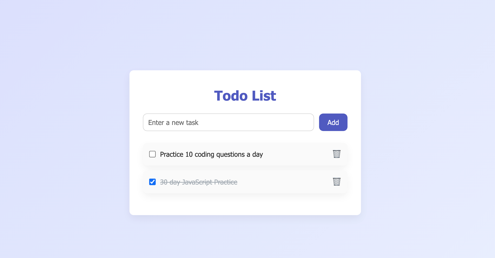

# Todo List App

A fully functional and stylish Todo List web application built using **HTML**, **CSS**, and **JavaScript**. This project is designed for anyone looking to manage tasks efficiently with an intuitive UI and smooth user experience.

---

## Features

✔️ Add new tasks  
✔️ Delete tasks  
✔️ Mark tasks as completed using a checkbox  
✔️ Stylish UI with modern CSS design  
✔️ Responsive and accessible layout  
✔️ Clear separation of concerns (HTML, CSS, JS in separate files)  

---

## Tech Stack

- **HTML5** – For building the structure  
- **CSS3** – For elegant and responsive styling using CSS variables and animations  
- **JavaScript (ES6)** – For DOM manipulation and handling interactivity  

---

## How to Use

1. Clone the repository:
   ```bash
   git clone https://github.com/your-username/todo-list-app.git
   ```
2. Navigate to the project folder:
  ```bash
    cd todo-list-app
   ```
3. Open index.html in your browser or use Live Server (VSCode extension).


## Demo Screenshot
